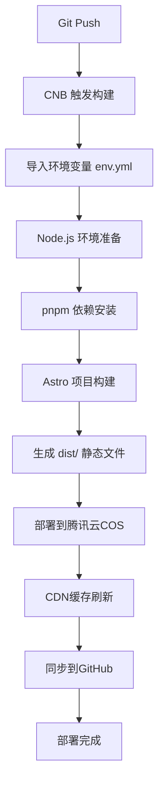

# CNB 配置说明文档

## 文件结构

```
.cnb.yml - 主要的CNB构建配置文件
env.yml - 密钥仓库中的环境变量配置文件
```

## 配置概述

本项目使用腾讯云CNB (Cloud Native Build) 进行自动化构建和部署。配置文件 `.cnb.yml` 定义了完整的CI/CD流程。

## 🔑 环境变量配置方式

**重要说明**：CNB的环境变量配置通过**密钥仓库**进行管理，而不是在CNB控制台直接设置。

### 配置方法
1. **密钥仓库文件**：在项目仓库中创建 `env.yml` 文件
2. **导入配置**：在 `.cnb.yml` 中使用 `imports` 导入环境变量
3. **引用变量**：使用 `${VARIABLE_NAME}` 格式引用变量

### 导入语法
```yaml
imports: https://cnb.cool/l-souljourney/souljourney-astro/-/blob/main/env.yml
```

### env.yml 文件示例
```yaml
# 腾讯云COS配置
COS_SECRET_ID: your_secret_id
COS_SECRET_KEY: your_secret_key
COS_BUCKET: your_bucket_name
COS_REGION: ap-shanghai

# CDN配置(可选)
CDN_DOMAIN: blog.l-souljourney.cn

# GitHub同步(可选)
GITHUB_TOKEN: ghp_xxxxxxxxxxxx
```

## 配置变更历史

### 2025-06-20 - 环境变量修复版本

**关键修复：**
1. **添加imports配置**：正确导入密钥仓库中的环境变量
   - 路径：`https://cnb.cool/l-souljourney/souljourney-astro/-/blob/main/env.yml`
   - 适用于所有分支和触发条件

2. **COS部署问题解决**：
   - 环境变量现在能正确传递给COS插件
   - 应该能看到COS部署的日志输出

### 2025-06-20 - 性能优化版本

**主要优化：**
1. **镜像源优化**：改用腾讯云官方镜像源 `https://mirrors.cloud.tencent.com/npm/`
   - 提供更好的国内访问速度
   - 腾讯云内部网络优化
   - 减少网络延迟和超时问题

2. **配置精简**：
   - 移除不必要的超时保护机制
   - 简化网络配置参数
   - 移除复杂的fallback策略

3. **构建流程优化**：
   - 简化依赖安装步骤
   - 保留核心构建检查
   - 优化日志输出

### 2025-06-20 - 问题修复版本

**修复内容：**
1. **构建超时问题**：
   - 添加 `timeout` 命令防止卡死
   - 配置网络超时参数
   - 添加重试机制

2. **网络优化**：
   - 使用国内镜像源加速
   - 配置离线优先安装
   - 添加fallback安装策略

### 2025-06-19 - 语法修复版本

**修复内容：**
1. **CNB语法标准化**：使用 `docker: {image:}` + `stages:` 格式
2. **插件配置修复**：正确配置腾讯云COS和CDN插件
3. **分支策略**：定义main、develop、PR的不同构建策略

## 部署架构



## 环境变量配置

### 配置位置
**密钥仓库文件**：`env.yml`（位于项目根目录）

### 必需环境变量

```yaml
# 腾讯云COS配置
COS_SECRET_ID: your_secret_id       # 腾讯云Secret ID
COS_SECRET_KEY: your_secret_key     # 腾讯云Secret Key  
COS_BUCKET: your_bucket_name        # COS存储桶名称
COS_REGION: ap-shanghai             # COS区域
```

### 可选环境变量

```yaml
# CDN配置(可选)
CDN_DOMAIN: blog.l-souljourney.cn   # CDN域名

# GitHub同步(可选) 
GITHUB_TOKEN: ghp_xxxxxxxxxxxx     # GitHub Personal Access Token
```

### 变量命名规则
根据 [CNB环境变量文档](https://docs.cnb.cool/zh/build/env.html)：
- 只能包含字母（大小写）、数字和下划线（_）
- 第一个字符不能是数字
- 不符合规则的变量会被忽略
- 变量值长度不能超过 100KiB

## 构建分支策略

### main分支 (生产环境)
- **触发条件**：推送到main分支
- **环境变量**：导入完整的 `env.yml` 配置
- **构建步骤**：完整构建 → COS部署 → CDN刷新 → GitHub同步
- **部署目标**：生产环境 (blog.l-souljourney.cn)

### develop分支 (开发环境)  
- **触发条件**：推送到develop分支
- **环境变量**：导入完整的 `env.yml` 配置
- **构建步骤**：构建测试(不部署)
- **用途**：验证代码可构建性

### Pull Request (代码审查)
- **触发条件**：创建或更新PR
- **环境变量**：导入完整的 `env.yml` 配置
- **构建步骤**：快速构建检查
- **用途**：确保PR不会破坏构建

## 构建性能优化

### 镜像源优化
- 使用腾讯云官方镜像源：`https://mirrors.cloud.tencent.com/npm/`
- 腾讯云内部网络优化，减少网络延迟
- 相比淘宝镜像源更稳定可靠

### 依赖缓存
- CNB自动缓存 `node_modules` 和 pnpm store
- 二次构建时复用缓存，大幅提升速度
- `--frozen-lockfile` 确保依赖版本一致

### 构建产物
- 检查构建产物完整性
- 统计文件数量验证构建成功
- 清晰的日志输出便于问题排查

## 故障排查

### 常见问题

1. **环境变量无法读取**
   - 检查 `env.yml` 文件是否存在于仓库根目录
   - 验证 `imports` 路径是否正确
   - 确认变量名符合命名规则

2. **COS部署无日志**
   - ✅ 现在应该已修复（通过imports导入环境变量）
   - 检查 `env.yml` 中COS相关变量是否正确配置
   - 验证COS权限设置

3. **构建时间过长**
   - 当前4分钟是正常范围
   - 主要时间消耗在依赖下载
   - 二次构建会利用缓存加速

### 调试建议

1. **本地测试**：
   ```bash
   pnpm install
   pnpm build
   ls -la dist/
   ```

2. **检查环境变量文件**：
   ```bash
   cat env.yml
   # 确认变量格式正确
   ```

3. **验证导入路径**：
   ```bash
   # 确认文件可访问
   curl https://cnb.cool/l-souljourney/souljourney-astro/-/blob/main/env.yml
   ```

## 相关文档

- [CNB环境变量配置](https://docs.cnb.cool/zh/build/env.html)
- [腾讯云CNB官方文档](https://cloud.tencent.com/document/product/1135)
- [腾讯云COS文档](https://cloud.tencent.com/document/product/436)  
- [Astro构建指南](https://docs.astro.build/en/guides/deploy/)
- [pnpm官方文档](https://pnpm.io/zh/)